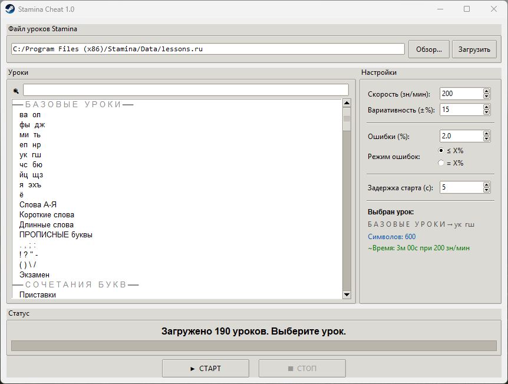

# Stamina Cheat 🎹

Устал печатать вручную? Эта программа сделает всё за тебя.
Автоматически проходит уроки в Stamina с нужной скоростью и ошибками.

## 📥 Скачать

👉 [Скачать .exe для Windows](https://github.com/okyrihuw/stamina-cheat/releases/latest)

Просто скачай и запусти — ничего устанавливать не нужно.

## 🖼 Скриншот



## ✨ Что умеет

- Подгружает все уроки прямо из Stamina — ничего не нужно копировать вручную
- Поиск урока по названию
- Настройка скорости (зн/мин) и вариативности (±%) — не выглядит как бот
- Два режима ошибок: **≤ X%** (не более) и **= X%** (ровно столько)
- Ошибки реалистичные: печатает соседнюю клавишу, потом правильный символ
- Обратный отсчёт перед стартом — успеваешь переключиться в окно Stamina

## ⚙️ Где взять файл уроков

1. Открой папку, куда установлена Stamina (обычно `C:\Program Files (x86)\Stamina\`)
2. Зайди в `Data\`
3. Там будет файл `lessons.ru` — укажи путь к нему в программе

Полный путь обычно выглядит так:
```
C:\Program Files (x86)\Stamina\Data\lessons.ru
```

Если Stamina установлена в другое место — просто найди папку через кнопку **"Обзор…"** в программе.

## 🚀 Запуск из исходника

Если не хочешь скачивать exe — можно запустить напрямую.

Требования: Python 3.10+
```bash
pip install pynput
python stamina_cheat.py
```

## 🔨 Собрать exe самому
```bash
pip install pyinstaller
pyinstaller --onefile --windowed stamina_cheat.py
```

## 📄 Лицензия

MIT